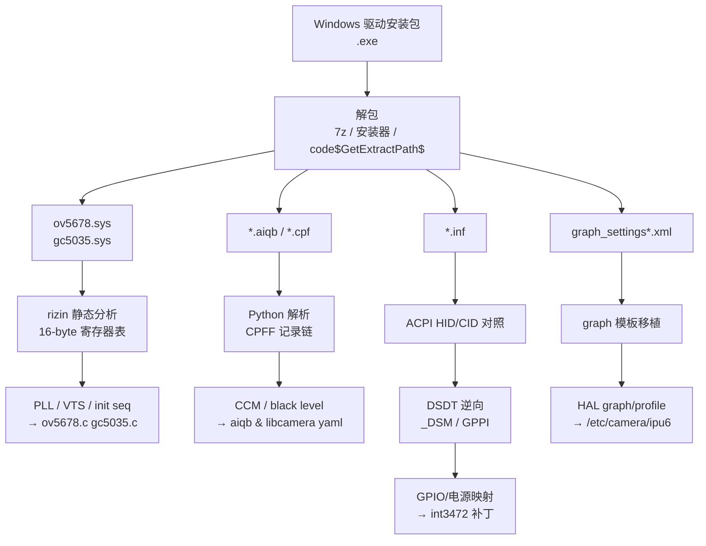

# Windows 驱动逆向与 HAL 适配记录（Lenovo Yoga Duet 7 13ITL6 / 82MA）

本文记录把这台机器的 **Intel IPU6 (Tiger Lake)** 双摄（前置 **OV5678** RGB-IR、
后置 **GC5035**）在 Linux 上跑到可用，所经历的**参数逆向**与 **HAL 配置适配**全过程。

**核心主题是从厂商 Windows 驱动包里逆向提取"金标准"参数**——包括传感器寄存器
（PLL / VTS）、3A 调校数据（aiqb）、电源/时钟拓扑（ACPI）以及 HAL 图配置——因为这些
参数在公开的上游 Linux 源码里**并不存在或与真机不符**。

---

## ⚠️ 免责声明 / Legal & Ethical Notice

> **请在阅读本文任何技术细节前先读完本节。**
>
> 1. **用途限制**：本文记录的技术仅用于**让用户在自己合法拥有的个人计算设备上**
>    实现硬件的**互操作性（interoperability）**——即让 Linux 能够驱动本机硬件。
>    这是设备所有者维护自己设备的正当目的。
> 2. **不传播专有代码/数据**：本文**不包含、也不提供**任何厂商二进制文件（`.sys`、
>    `.dll`、`.aiqb`、`.cpf` 等）、反编译源码或受版权保护的完整数据表。文中出现的
>    寄存器值、矩阵、常量属于**接口层面的功能性事实（functional facts）**，为互操作性
>    所必需；厂商固件与调校文件本体**不随本仓库分发**。
> 3. **来源合法性**：逆向所用的驱动程序包来自**用户自行从设备厂商公开发布渠道获取**
>    的 Windows 安装包。使用者须自行确保其获取与使用行为符合当地法律及软件许可协议。
> 4. **无担保**：本文及关联脚本"按现状（AS-IS）"提供，**不作任何明示或暗示担保**，
>    包括但不限于适销性、特定用途适用性、不侵权。按本文操作导致的任何后果（设备损坏、
>    保修失效、数据丢失、法律风险）由使用者自行承担。
> 5. **商标归属**：Intel、IPU6、Lenovo、Yoga、OmniVision、OV5678、GalaxyCore、
>    GC5035、Windows 等名称与商标归各自所有者。本文与这些厂商**无任何隶属或背书关系**。
> 6. **尊重许可**：本仓库自身代码以上游/仓库声明之许可发布；**厂商二进制与其提取数据
>    不在授权范围内**，请勿再分发。若权利方认为本文有不当之处，请通过仓库 issue 联系，
>    我们会配合移除。
> 7. **合规提醒**：在部分司法辖区，规避技术保护措施（如破解加密/签名）可能违法。
>    本文所述方法**仅涉及格式解析与静态分析**（读公开接口的数据结构），**不涉及**
>    破解加密、绕过签名验证或规避任何技术保护措施。

---

## 1. 为什么必须逆向

Linux 侧能拿到的"上游"信息与真机严重不符：

| 层 | 上游 Linux 现状 | 真机需求 | 缺口 |
|---|---|---|---|
| 传感器驱动 | 用 `ov5675.c` 驱动 OV5678（同寄存器族，chip id 同 `0x5675`） | OV5678 有自己的 PLL/VTS golden | 上游只有 OV5675 参数 |
| 后摄驱动 | mainline 内核**没有** gc5035 | GC5035 + 定制上电时序/OTP | 驱动不存在 |
| 3A 调校 | 通用/无 | 厂商 aiqb（RGB-IR 专用 CCM/black level/LSC） | 厂商私有 |
| 电源/时钟 | ACPI int3472 标准映射 | BIOS 用非标 GPIO type（0x0e/0x0f/0x11） | 需解析 DSDT |
| HAL 图配置 | 无本机 profile | 厂商 graph_settings / descriptor | 厂商私有 |

结论：**必须从厂商 Windows 驱动包中获取这些"金标准"参数**。

---

## 2. 逆向素材与来源映射

Windows 驱动包解包目录（`win_cam_driver/code$GetExtractPath$/`）提供了**一整套**与
Linux 栈一一对应的参考物：

| Windows 文件 | 类型 | Linux 侧对应 / 用途 |
|---|---|---|
| `ov5678.sys` | 传感器驱动二进制 | `ov5678.c` 寄存器表（PLL / VTS / init seq） |
| `gc5035.sys` | 传感器驱动二进制 | `gc5035.c` 寄存器表 |
| `OV5678_CJFK520_TGL.aiqb` | 3A 调校数据 | libcamhal 的 `ov5678.aiqb`；libcamera 的 `.yaml` |
| `gc5035_CJAK519_TGL.aiqb` | 3A 调校数据 | `gc5035.aiqb` |
| `OV5678_CJFK520_TGL.cpf` / `gc5035_CJAK519_TGL.cpf` | 校准/容器数据 | 参考（未直接使用） |
| `graph_settings_OV5678_CJFK520_TGL.xml` | HAL 图设置 | `graph_settings_ov5678.xml` **模板** |
| `graph_settings_gc5035_CJAK519_TGL.xml` | HAL 图设置 | `graph_settings_gc5035.xml` **模板** |
| `graph_descriptor_TGL_H.xml` | HAL 图描述符 | `graph_descriptor.xml` 参考 |
| `out.svendict_isys.xml` / `out.svendict_psys.xml` | 事件字典 | 理解 HAL 事件流 |
| `*.inf`（UTF-16） | 安装配置 | ACPI HID/CID、设备拓扑参考 |
| `mp2410.sys` | PMIC 驱动 | 板级电源（经 DSDT 分析后**判定非必需**） |

> 注意：**这些二进制/数据文件不随本仓库分发**（见免责声明 §2）。仓库只保存从其
> 中提取的、互操作性所需的功能性事实。

### 逆向工作流总览



---

## 3. 逆向一：`.sys` 传感器寄存器表（方法：rizin 静态分析）

### 3.1 工具与流程

目标：Windows `ov5678.sys`（Cobalt TGL，符号 `ov5678.pdb`）。

```bash
# 查看节区布局，定位 .rdata
rz-bin -S /tmp/ov5678.sys

# 以十六进制方式 dump 指定虚拟地址的内容
rizin -q -c "e scr.color=false; px @ 0x1400206b0" /tmp/ov5678.sys
```

### 3.2 定位寄存器表的"签名"

在 `.rdata` 中，sensor 初始化寄存器表呈现**高度规律**的结构，识别其特征即可定位：

- 节区映射关系：物理偏移 `paddr 0x1e600` ↔ 虚拟地址 `vaddr 0x140020000`
  → 文件偏移 `file_off = VMA − 0x140020000 + 0x1e600`
- 找到 **5 个 mode 块**（同一 datarate，对应 native + 若干 scale 模式）：
  VMA `0x1400206b0 / 0x1400210d0 / 0x140021af0 / 0x1400228d0 / 0x1400232f0`

### 3.3 表项格式（关键发现）

每个表项固定 **16 字节**：

```
[01 00 00 00] [reg_lo reg_hi 00 00] [val_lo val_hi 00 00] [00 00 00 00]
```

- `reg = D[o+4] | (D[o+5] << 8)`（16-bit 小端）
- `val = D[o+8] | (D[o+9] << 8)`（16-bit 小端）
- 首字节 `01` 为"有效/写"标记；末尾 4 字节为填充。

用 Python 按此步长遍历即可还原出完整的 `(reg, val)` 序列（等价于 Linux 的
`struct ov5678_reg reg_list[]`）。

### 3.4 提取出的决定性差异（Windows vs Linux 上游）

对比 Windows 金标准与 Linux 上游 `ov5675.c`（即"把 OV5678 当 OV5675 配"），
得到以下**已落地到 `ov5678.c`** 的修正：

| # | 项目 | Windows（金标准） | Linux 上游（OV5675） | 影响 |
|---|---|---|---|---|
| 1 | **VTS（2592×1944 模式）** | `0x380e/0x380f = 0x07d0` (2000) | `0x07e4` (2020) | 帧率 **30.00 fps** vs 29.70 fps |
| 2 | **MIPI PLL** | `0x0300=0x07, 0x0301=0x01, 0x0302=0x77, 0x0303=0x00, 0x030b=0x02, 0x030d=0x4b` | `0x0300=0x04, 0x0302=0x8d, 0x0303=0x00, 0x030d=0x26` | Linux **完全缺失** `0x0301`/`0x030b`；`0x030d` 75 vs 38（≈2×） |
| 3 | **`0x5000` ISP_Ctrl** | `0x71` | `0x77` | 位 1/2（`0x06`）不同 |
| 4 | **OTP/校准寄存器** | `0x3d8c=0x71, 0x3d8d=0xe7` | **完全未写** | 校准相关 |
| 5 | 数据通道 | 2-lane | 2-lane | 同 |

代码落地（见 `drivers/baseline-cache/ov5678/ov5678.c`）：

```c
#define OV5678_VTS_30FPS   0x07d0          /* 原 OV5675 为 0x07e4 */

static const struct ov5678_reg mipi_data_rate_900mbps[] = {
    {0x0103, 0x01}, {0x0100, 0x00},
    /* OV5678 PLL config from ov5678.sys (Windows golden); was ov5675 values */
    {0x0300, 0x07}, {0x0301, 0x01}, {0x0302, 0x77},
    {0x0303, 0x00}, {0x030b, 0x02}, {0x030d, 0x4b},
};

/* mode_2592x1944_regs[] 内： */
{0x380f, 0xd0}, /* VTS=2000 (exact 30fps; was 0x07e4) */
```

> ⚠️ **方法论提醒**：OV 系列各型号的 PLL 位定义是私有的，无法从字节值直接反推
> 绝对 datarate。因此本文的结论是**结构性的**——Linux 用的是 OV5675 的 PLL golden，
> 而非 OV5678 的。要得到绝对一致性，只能**以 Windows 值为权威**照搬。

---

## 4. 逆向二：aiqb / CPF 3A 调校数据（方法：CPFF 记录链解析）

### 4.1 aiqb 文件格式

Intel **AIQB（ia_mkn / CPFF）** 是一个**扁平的 tagged record 链**：

```
文件起始于 0x50
每条记录头 8 字节: [u32 size][u8 fmt][u8 key][u16 name_id]
下一条记录偏移 = 当前偏移 + size
```

参考：<https://jetm.github.io/blog/posts/ipu6-aiqb-calibration/>

`name_id` 语义（实测 + 对照）：

| name_id | 含义 |
|---|---|
| 2 | GENERAL_DATA（分辨率 / 位深 / bayer order） |
| 3 | AWB / CHROMA |
| 7 | SENSITIVITY（Base ISO） |
| 22 | AWB |
| **25** | **ADV_COLOR_MATRICES（CCM，色彩校正矩阵）** |
| 26 | BLACK_LEVEL |
| 28 | LSC / 暗角 |
| 29 | GRID / GAMMA |
| 31 | GAMMA-LUT（tone-map） |

### 4.2 解析脚本

工作区脚本 `parse_aiqb_records.py` 实现记录链遍历与关键记录解码：

```python
FIRST = 0x50
# 遍历
while o + 8 <= n:
    size = struct.unpack_from("<I", data, o)[0]
    fmt, key, name = data[o+4], data[o+5], struct.unpack_from("<H", data, o+6)[0]
    recs.append((o, size, fmt, key, name))
    if size < 8: break
    o += size
```

CCM（id25）内部结构：`num_light_srcs` + `num_sectors`，每光源含 `src_type / rpg /
bpg / cix / ciy / cct` + 传统 9 元素矩阵 + 高级（按 sector）矩阵。

```bash
python3 parse_aiqb_records.py gc5035_CJAK519_TGL.aiqb --full
```

### 4.3 提取结果

**GC5035**：6 个独立 CCM 块（按白点 R/B 从暖到冷排序），例如：

```
[0] @0x025e50  白点(R/G,B/G) 0.9577,0.4384 / 0.4520,0.4170
    CCM: 1.8509 -0.6306 -0.2203
        -0.6122  2.1296 -0.5174
        -0.2315 -1.4744  2.7059      (行和均为 1.000)
```

**OV5678**：11 个独立 CCM 块，例如：

```
[0] @0x02de44  白点 0.8633,0.4297 / 0.4640,0.4100
    CCM: 1.7138 -0.2320 -0.4818
        -0.3555  1.9925 -0.6371
        -0.6003 -1.0833  2.6836
```

其它关键记录：**Base ISO (id7) = 54**、**Black Level (id26) = 4096**。

结果落盘为 `aiqb_ccm_extracted.txt` 与 `aiqb_ccm_extracted.json`。

### 4.4 落地去向

- **libcamhal 路径**：直接用厂商 `.aiqb`（`ov5678.aiqb` / `gc5035.aiqb`）——
  HAL 原生读取，无需转换。
- **libcamera soft-ISP 路径**：把提取值写入
  `/usr/local/share/libcamera/ipa/simple/gc5035.yaml`
  （BlackLevel `4096` + 6 个 CCM）。

---

## 5. 逆向三：ACPI / DSDT（GPIO、电源、时钟）

### 5.1 方法

```bash
# 导出并反编译 DSDT
sudo cat /sys/firmware/acpi/tables/DSDT > dsdt.dat
iasl -d dsdt.dat                      # 得到 dsdt.dsl
```

### 5.2 DSDT 的三大发现

这三项直接改变了项目方向（原本以为必须逆向 MPWR2410 PMIC）：

1. **D-1：传感器 GPIO 实际在系统 gpiochip0（`\_SB.GPI0`）**
   ACPI 的 `PINR(pin, group)` 生成 `GpioIo(... "\_SB.GPI0" ...)` 资源；
   `\_SB.GPI0` 的 `_HID` 动态返回 `INT34C5/INT34C6`（PCH/LPSS GPIO，即系统唯一的
   gpiochip0）→ **电源使能 GPIO 可直接用标准 GPIO 控制，不经 MPWR2410**。

2. **D-2：INT3472 `_DSM` 揭示 GPIO type 的来源**
   `_DSM` UUID `79234640-9e10-4fea-a5c1-b5aa8b19756f` 返回
   `GPPI(F=type, 全局pin=0x20*group+pin, I=in/out, A=active)`。
   BIOS 在 `C1Fx` 里填的板级配置给出了**非标准 type** `0x0e / 0x0f / 0x11`，
   内核 int3472 不认 → 只建了空名 disabled regulator → 需扩展映射。

3. **D-3：MCLK 由 LPSS/PCH 时钟分频器产生，非 MPWR2410**
   `CLKC()` / `CLKF()` 操作 `OpRegion(ICLK, ..., SBRG+ICKP<<16+0x8000, 0x40)` 中的
   `CLL0-5 / CLH0-1`（bit1 选分频、bit0 使能）；`GPCL = Package(0x12)`（18 项）
   与 IPU6 buttress 的 18 频率表吻合。

**结论**：电源（GPIO）与时钟（LPSS clk）都**不依赖 MPWR2410** → 无需逆向该 PMIC。

### 5.3 DSC0（GCTI5035）GPIO ↔ gpiochip0 line 映射

由 `_DSM` 解析得 `base = pin − 96`：

| ACPI type | pin | gpiochip0 line | 含义 | 落地 con_id |
|---|---|---|---|---|
| **0x10 (DOVDD)** | 192 | **96** | **I/O 供电（必需）** | `iovdd` ✓ |
| 0x11 | 193 | 97 | — | `avdd` |
| 0x0e | 196 | 100 | 非标准，忽略 | （ignore） |
| 0x0f | 197 | 101 | — | `dvdd` |

> **决定性实验**：手动拉高 line96 后重载 gc5035 → `chip_id_h=0x50` 立即 ACK；
> 释放恢复 `-121`。证明 **iovdd 必须映射到 DOVDD(0x10)**，此前映射 0x0e 是错的。
> 限制：`INT3472_MAX_REGULATORS=3` → 4 条"供电轨"中必须丢弃一条（丢非标 0x0e）。

落地为 `drivers/patches/003-int3472-discrete.patch` 与 `…-ignore-gcti5035-…` 补丁。

---

## 6. 逆向四：Windows HAL graph XML 作为模板

Windows 包内的 `graph_settings_*.xml` / `graph_descriptor_TGL_H.xml` 是 Linux
`/etc/camera/ipu6/gcss/` 配置的**直接模板**：

- `graph_settings_gc5035.xml` 内容与 Windows `graph_settings_gc5035_CJAK519_TGL.xml`
  一致，作为基础移植；
- `sensors/gc5035-uf.xml` 注释明确要求：**分辨率必须与 Windows graph 的 video0
  节点一致**；
- `graph_descriptor.xml` 的 `<apply>` / `<connection>` 引用名结构照搬 Windows。

---

## 7. HAL 适配：靠"配置匹配"而非源码补丁

HAL 层的核心洞察：**让摄像头工作的关键是配置匹配，而不是改上游源码**
（上游 `ipu6-camera-hal` 保持 `6fefa86` 不变）。

### 7.1 枚举机制（理解它才能配对）

1. `CameraParser::getAvailableSensors()` 读 `libcamhal_profile.xml` 的
   `availableSensors`，对每项 `名字-uf-CSI端口`（如 `ov5678-uf-2`）：
   `sensorName = ov5678`，sink = `"Intel IPU6 CSI2 2"`。
2. `MediaControl::checkAvailableSensor()` 找到该 sink entity，再对其 source 做
   **前缀匹配** `checkHasSource(entity, "ov5678 ")`。
3. ⇒ **`sensorName` 必须等于 media entity 名第一段**，即驱动 `.name`。
4. sensor XML 的 `$I2CBUS` 被替换为 `getI2CBusAddress()` 结果（`3-0036`），
   故须写 `ov5678 $I2CBUS` 才能展开为真实实体名 `ov5678 3-0036`。

### 7.2 决定性根因：descriptor 引用名必须匹配 settings 程序名

`graph_descriptor.xml` 的 `<apply target>` / `<connection source/sink>` **引用名**
必须等于 `graph_settings_*.xml` 中 settings 块的**程序名**：

- settings 块用 `<isa_lb_ir_video>` → descriptor 必须引用 `isa_lb_ir_video`。
- 不匹配 → `Failed to generate kernel list` + `not-negotiated` +
  `No matching graph config found`。

> 注意 `<node name="isa_lb_rgbir_video_bayer" pg_id="187">` 只是**节点定义名**，
> 不参与匹配，无需改。

### 7.3 RGB-IR 处理（OV5678 的核心适配）

OV5678 是 4×4 RGB-IR（25% IR + 75% RGB）。若按普通 bayer 处理，IR 像素被当颜色
像素 → 偏蓝/偏冷。修复：把 8 个 8-bpp 分辨率块全部改造为 **RGB-IR settings**
（`id=100204`、程序名 `isa_lb_ir_video`、含 `ir_md` 端口、`rgb_ir_2_0` 双端口输出）。

| settings key | 分辨率 |
|---|---|
| 8000 | 320×240 |
| 8001 | 640×360 |
| 8002 | 640×480 |
| 8003 | 1280×720 |
| 8004 | 1280×960 |
| 8005 | 1600×1200 |
| 8006 | 1920×1080 |
| 8007 | 2560×1920 |

（原生 2592×1944 与半分辨率 1296×972 因无对应 settings 块，已从 sensor XML 的
`supportedStreamConfig` 删除。）

---

## 8. 验证方法（量化，不靠肉眼）

| 目标 | 方法 |
|---|---|
| 出帧 | `gst-launch-1.0 icamerasrc device-name=ov5678-uf ! video/x-raw,width=1280,height=720,format=NV12 ! queue ! multifilesink location=/tmp/x_%d.yuv max-files=5` |
| 帧完整性 | 帧大小应为 `1384320` 字节（NV12 1280×720） |
| 颜色中性 | numpy 分析 NV12 的 U/V：亮区/暗区/整体应接近 128；明显偏离即偏色 |
| 传感器 ACK | `i2cdetect` / 读 chip id（`0x50`、`0x5675`） |
| HAL 加载 aiqb | HAL 日志出现 `aiqb file name ov5678.aiqb` |
| GPIO 映射 | 重启后 dmesg 见 `mapped type->0x10 con_id=iovdd` |

> ⚠️ **U/V 分析的坑**：NV12 的 UV 是半分辨率平面且末尾可能有 padding，**不能直接
> 2D reshape**；要先把 Y 下采样 2×2 得到 mask 再索引 UV。

> ⚠️ **不要 SIGKILL gst**：强杀会在 ISYS 层造成 deadlock，之后连基线都出不了流，
> 必须重启。用 `multifilesink max-files=N` 让 pipeline **自然 EOS**。

---

## 9. 经验与踩坑（供后来者）

1. **厂商 Windows 包是一等公民**：它同时提供寄存器表、调校数据、ACPI 线索、
   graph 模板——比任何公开 Linux 源码都更"真机"。
2. **`.sys` 寄存器表有稳定格式**（本例 16 字节/项），定位到 `.rdata` 中的规律数组
   即可整体还原，无需完整反编译。
3. **ACPI 是第一手权威**：GPIO/电源/时钟的真实拓扑在 DSDT，不在驱动里。
   `_DSM` 的 `GPPI` 编码是解开非标 GPIO type 的钥匙。
4. **aiqb 是自描述的**（tagged chain），解析器比想象中简单。
5. **HAL 靠配置匹配**：改源码往往不是必需；匹配 profile/entity/settings 的名字
   才是关键。
6. **改名是全局的**：驱动 `.name` 一改，HAL 里所有前缀引用都要同步，否则 sensor
   被**静默剔除**（不报错，最难查）。
7. **热重载 IPU6 栈有风险**：`rmmod intel_ipu6` 会在 `ipu6_buttress_isr` 触发
   use-after-free/Oops，须重启；测 sensor 时只 `rmmod ov5678` 即可。
8. **验证要量化**：颜色/帧率都用数值判据，避免"看起来正常"。

---

## 10. 工具与脚本清单

| 工具/脚本 | 用途 |
|---|---|
| `rz-bin -S` / `rizin … px @ <vma>` | 分析 `.sys`，定位并 dump 寄存器表 |
| `iasl -d dsdt.dat` | 反编译 ACPI DSDT |
| `parse_aiqb_records.py` | 解析 aiqb（CPFF/ia_mkn）记录链 |
| `aiqb_parse.py` / `aiqb_dump.py` | CPFF 容器结构 / 头部 hexdump |
| `aiqb_ccm_*.py` / `aiqb_extract_ccm.py` / `aiqb_scan_ccm*.py` | 提取 CCM 块 |
| `extract_lut31.py` | 提取 id31 GAMMA-LUT |
| `render_color.py` / `demosaic_color.py` / `demosaic_fast.c` | 帧渲染与 RGB-IR demosaic |
| `gen_rgbir_blocks.py` | 生成 RGB-IR settings 块 |
| `read_gc5035_regs.py` | 运行期读 GC5035 VTS/HTS/曝光 |
| `gpioset` / `gpioinfo` | 验证 GPIO 电源轨映射 |

---

## 11. 参考资料

- Intel AIQB 校准格式解析：<https://jetm.github.io/blog/posts/ipu6-aiqb-calibration/>
- 上游 HAL：`intel/ipu6-camera-hal`（本仓库不改其源码）
- 相邻平台参考实现（如 Latitude 7320）：`ov5675.yaml`、`rgbir_to_bayer.cpp` 等
- 本仓库其它文档：[`../README.md`](../README.md)、[`../hal/README.md`](../hal/README.md)、
  [`../drivers/README.md`](../drivers/README.md)

---

*本文为工程技术记录，非厂商官方文档。再次强调：请遵守[免责声明](#️-免责声明--legal--ethical-notice)。*
